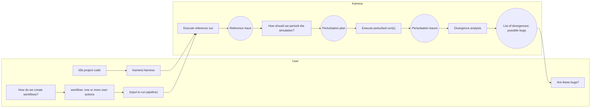

# Kamera E2E Pipeline (Text Diagram)

This document captures a text-based version of the current Kamera simulation-testing
pipeline vision. It is intended as a shared reference artifact while we harden the
pipeline incrementally.

## Legend

- **Rounded rectangle**: Kamera component/logic step
- **Oval**: artifact produced/consumed by Kamera
- **User-side**: inputs authored/provided outside Kamera internals
- **Kamera-side**: simulation, perturbation, and analysis pipeline
- **Status labels**:
  - `Concrete`: implemented and actively used
  - `Naive v1`: intentionally simple first-pass implementation
  - `Refine`: strategy still evolving

## Text Flow

```text
User:
  k8s project code
    -> kamera harness
    -> workflow(s): one or more user actions

Kamera:
  execute reference run
    -> reference trace
    -> choose perturbation plan
    -> execute perturbed run(s)
    -> perturbation trace(s)
    -> divergence analysis
    -> list of divergences (possible bugs)

User:
  review possible bugs
```

## Mermaid Diagram



## Current Status Snapshot

| Stage | Status | Notes |
|---|---|---|
| Harness + user action workflows | `Concrete` | Inputs + harness scenario construction are in active use. |
| Execute reference run | `Concrete` | Core explore execution path is established. |
| Perturbation planning | `Naive v1` | Core planner currently does a broad single rerun strategy. |
| Execute perturbed run(s) | `Concrete` | Wired through closed-loop phases in core explore. |
| Divergence analysis | `Concrete` | `kamera analyze diff/report` is available. |
| “Possible bugs” triage surface | `Refine` | Still maturing from raw divergences toward actionable bug triage. |
| Workflow synthesis strategy | `Refine` | Input/workflow generation strategy is still being iterated. |

## Naive v1 Policy (Current)

The current closed-loop policy is intentionally simple:

1. Run a reference phase with perturbations disabled.
2. Run one rerun phase with broad controller-order permutation enabled based on
   controllers observed in the reference trace.

This provides a working end-to-end feedback loop (“let it rip”) and is expected
to evolve as we collect evidence from overnight runs.
